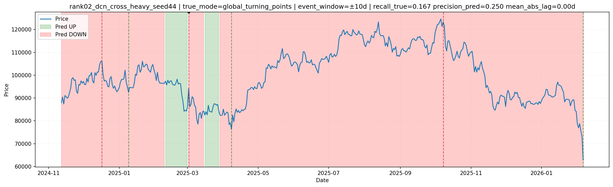
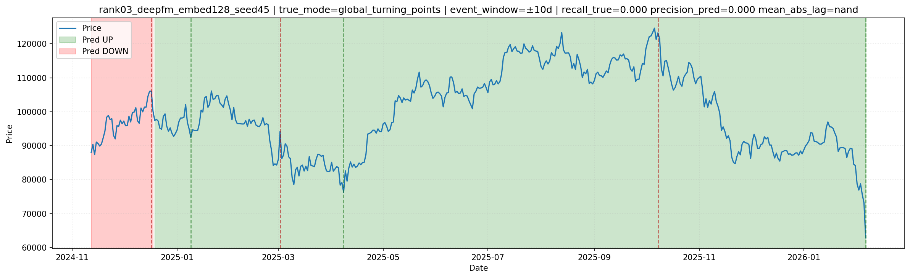
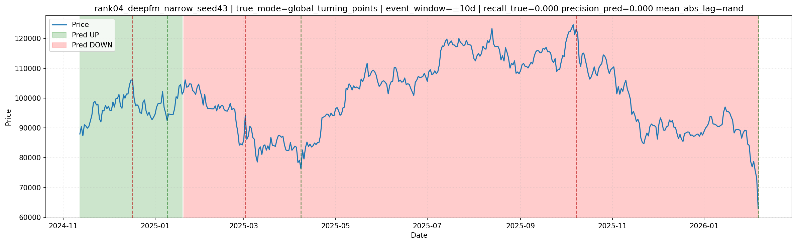
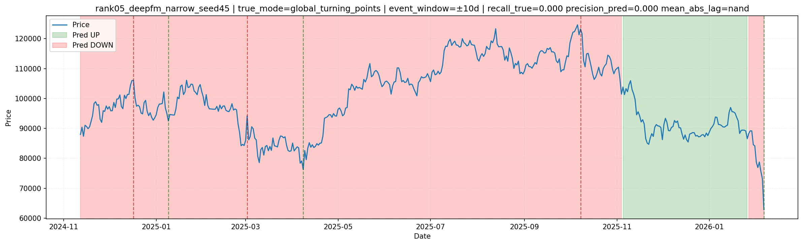

# Price Event Alignment Report

- Selected CSV: `RESEARCH/reports/astro_tabular_nn_postrun_wide_balance_20260208_055915/selected_models.csv`
- Dataset path: `/home/rut/ostrofun/RESEARCH/cache/astro_tabular_nn_best_grid__dataset__0faeef66.parquet`
- True mode: `global_turning_points`
- Pred mode: `hard_label`
- Event window: `±10 days`

## Summary

 global_rank            model model_type  seed  test_recall_min  test_recall_gap  test_mcc  test_acc  event_recall_true  event_precision_pred  event_mean_abs_lag_days  n_true_events  n_pred_events  n_matched_events                                                                                                                     plot_path
           1 dcn_dropout_high        dcn    45         0.668172         0.109606  0.131444  0.670354           0.166667              0.333333                      7.0              6              3                 1 RESEARCH/reports/astro_tabular_nn_price_event_report_20260208_061726/rank01_dcn_dropout_high_seed45_price_event_alignment.png
           2  dcn_cross_heavy        dcn    44         0.666667         0.227239  0.243405  0.889381           0.166667              0.250000                      0.0              6              4                 1  RESEARCH/reports/astro_tabular_nn_price_event_report_20260208_061726/rank02_dcn_cross_heavy_seed44_price_event_alignment.png
           3  deepfm_embed128     deepfm    45         0.589165         0.188613  0.103923  0.592920           0.000000              0.000000                      NaN              6              1                 0  RESEARCH/reports/astro_tabular_nn_price_event_report_20260208_061726/rank03_deepfm_embed128_seed45_price_event_alignment.png
           4    deepfm_narrow     deepfm    43         0.555556         0.397040  0.304877  0.944690           0.000000              0.000000                      NaN              6              1                 0    RESEARCH/reports/astro_tabular_nn_price_event_report_20260208_061726/rank04_deepfm_narrow_seed43_price_event_alignment.png
           5    deepfm_narrow     deepfm    45         0.444444         0.273389  0.050198  0.712389           0.000000              0.000000                      NaN              6              2                 0    RESEARCH/reports/astro_tabular_nn_price_event_report_20260208_061726/rank05_deepfm_narrow_seed45_price_event_alignment.png

## Charts

### Rank 1: `dcn_dropout_high` (seed `45`)

- Event recall (true): `0.1667`
- Event precision (pred): `0.3333`
- Mean abs lag (days): `7.00`

### Rank 2: `dcn_cross_heavy` (seed `44`)

- Event recall (true): `0.1667`
- Event precision (pred): `0.2500`
- Mean abs lag (days): `0.00`

### Rank 3: `deepfm_embed128` (seed `45`)

- Event recall (true): `0.0000`
- Event precision (pred): `0.0000`
- Mean abs lag (days): `n/a`

### Rank 4: `deepfm_narrow` (seed `43`)

- Event recall (true): `0.0000`
- Event precision (pred): `0.0000`
- Mean abs lag (days): `n/a`

### Rank 5: `deepfm_narrow` (seed `45`)

- Event recall (true): `0.0000`
- Event precision (pred): `0.0000`
- Mean abs lag (days): `n/a`

