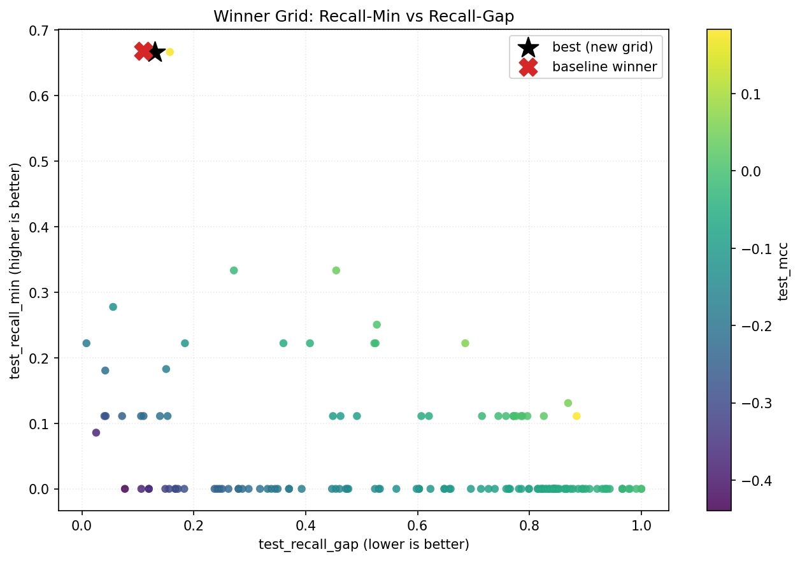
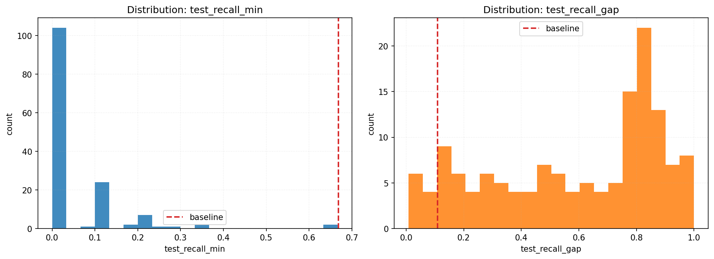
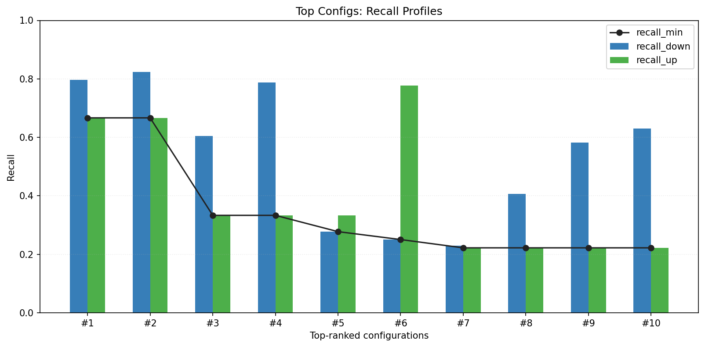
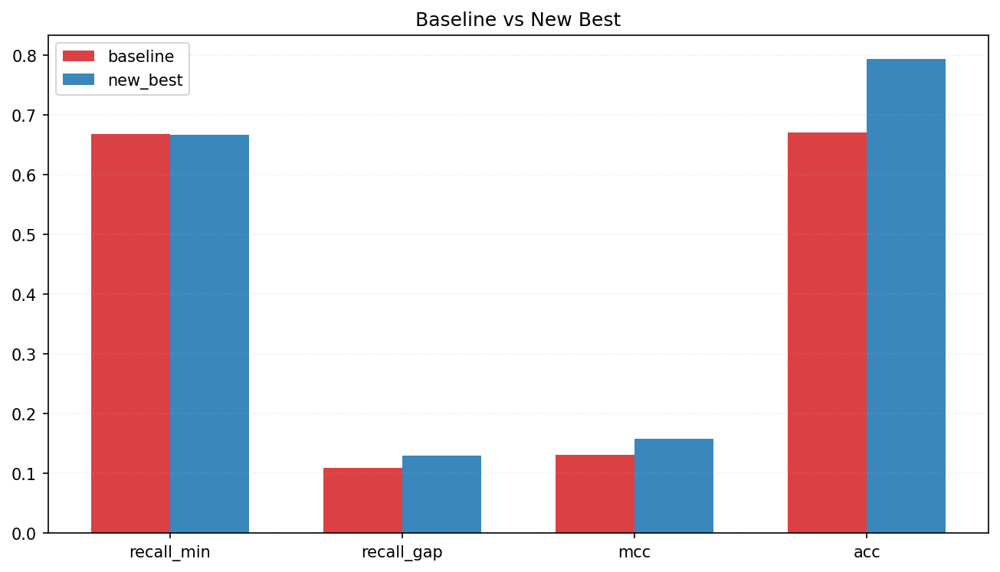
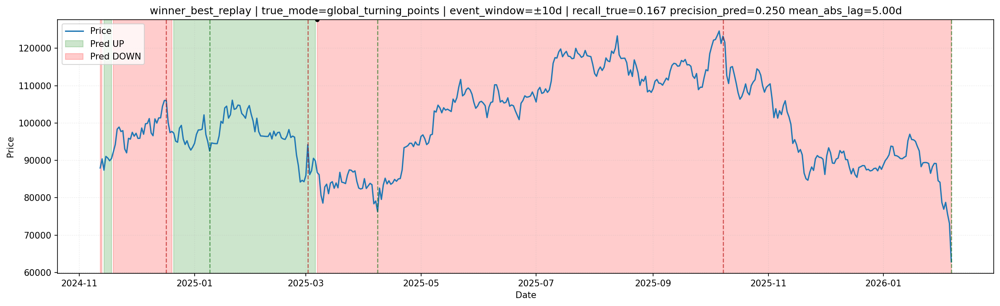

# Notebook-Style Post-Run Report (Winner DCN Grid Search)

- Source CSV: `RESEARCH/reports/astro_tabular_nn_grid_winner_dcn_balance_e8_t72_s2_20260208_062409.csv`
- Top15 CSV: `RESEARCH/reports/astro_tabular_nn_grid_winner_dcn_balance_e8_t72_s2_20260208_062409.top15.csv`
- Meta JSON: `RESEARCH/reports/astro_tabular_nn_grid_winner_dcn_balance_e8_t72_s2_20260208_062409.meta.json`
- Replay dataset path: `/home/rut/ostrofun/RESEARCH/cache/astro_tabular_nn_best_grid__dataset__0faeef66.parquet`
- Baseline selected CSV: `RESEARCH/reports/astro_tabular_nn_postrun_wide_balance_20260208_055915/selected_models.csv`
- Generated at: `2026-02-08T11:49:43+00:00`
- Ranking objective: maximize `test_recall_min`, then minimize `test_recall_gap`, then maximize `test_mcc`, then `test_acc`.

## Baseline vs New Best

- Baseline model: `dcn_dropout_high` (`dcn`), seed `45`
- Baseline test: recall_min=`0.6682`, recall_gap=`0.1096`, MCC=`0.1314`, ACC=`0.6704`

- New best run_id `54`, seed `45`, dims `384x192x96`
- New best test: recall_min=`0.6667`, recall_gap=`0.1302`, MCC=`0.1583`, ACC=`0.7942`

- Delta recall_min: `-0.0015`
- Delta recall_gap: `+0.0206` (negative is better)
- Delta MCC: `+0.0269`
- Delta ACC: `+0.1239`

## Grid Coverage Summary

- Total runs: `144`
- Runs with `test_recall_min >= 0.5`: `2`
- Runs with `test_recall_min >= 0.6`: `2`
- Runs with `test_recall_min >= baseline (0.6682)`: `0`

## Charts

### 1) Recall-Min vs Recall-Gap (all runs)



### 2) Metric Distributions



### 3) Top Recall Profiles



### 4) Baseline vs New Best



### 5) Test Price Markup (Best Run Replay)

- Event recall (true): `0.1667`
- Event precision (pred): `0.2500`
- Mean abs lag (days): `5.00`
- Events: true=`6`, pred=`4`, matched=`1`



## Conclusions & Next Grid

- Top-15 trend corr(`hidden_sum`, `recall_min`) = `-0.485`.
- Top-15 trend corr(`dropout`, `recall_min`) = `+0.414`.
- Runs with `recall_min >= 0.60` in current table: hidden_dims `384x192x96`, dropout `0.35, 0.45`.
- Practical takeaway: higher dropout trend is visible, but shrink-to-small network trend is not confirmed for `recall_min` objective.
- Next directional grid to test your hypothesis safely:
  - hidden_dims: `192x96`, `256x128`, `320x160`, `384x192x96`
  - dropout: `0.40, 0.45, 0.50, 0.55, 0.60`
  - keep DCN and test both `cross 2..6` with `rank 32..96`
  - preserve objective: maximize `recall_min`, then minimize `recall_gap`

## Leaderboard (Top 15)

- Saved table: `RESEARCH/reports/astro_tabular_nn_winner_grid_report_20260208_062409/astro_tabular_nn_grid_winner_dcn_balance_e8_t72_s2_20260208_062409.top15.csv`

```text
 run_id  seed model_type hidden_dims  dropout  cross_layers  cross_rank  learning_rate  weight_decay  class_weight_power  label_smoothing  batch_size  best_margin  best_val_score  test_recall_down  test_recall_up  test_recall_min  test_recall_gap  test_mcc  test_acc
     54    45        dcn  384x192x96     0.45             3          64         0.0010       0.00010                 1.6             0.05         384         0.69        0.422494          0.796840        0.666667         0.666667         0.130173  0.158314  0.794248
     69    44        dcn  384x192x96     0.35             6          96         0.0005       0.00001                 1.4             0.05         512         0.70        0.459037          0.823928        0.666667         0.666667         0.157261  0.176190  0.820796
     12    44        dcn 640x320x160     0.45             2         128         0.0003       0.00005                 1.3             0.02         512         0.56        0.422730          0.604966        0.333333         0.333333         0.271633 -0.017641  0.599558
     17    45        dcn  384x192x96     0.40             3          32         0.0015       0.00050                 1.5             0.02         768         0.80        0.396032          0.787810        0.333333         0.333333         0.454477  0.041222  0.778761
      8    45        dcn 512x256x128     0.40             5          64         0.0005       0.00050                 1.6             0.00         512         0.66        0.426362          0.277652        0.333333         0.277652         0.055681 -0.120335  0.278761
     13    45        dcn 640x320x160     0.25             4         128         0.0003       0.00010                 1.3             0.05         768         0.47        0.437253          0.250564        0.777778         0.250564         0.527213  0.009144  0.261062
     42    44        dcn  384x192x96     0.40             5          64         0.0010       0.00005                 1.3             0.01         512         0.40        0.411909          0.230248        0.222222         0.222222         0.008026 -0.178801  0.230088
     20    44        dcn 512x256x128     0.25             5          64         0.0003       0.00010                 1.2             0.00         768         0.53        0.393354          0.406321        0.222222         0.222222         0.184098 -0.105363  0.402655
     49    45        dcn 512x256x128     0.40             6         128         0.0003       0.00001                 1.3             0.02         768         0.79        0.375533          0.582393        0.222222         0.222222         0.360171 -0.055421  0.575221
     71    44        dcn 640x320x160     0.25             6          32         0.0010       0.00005                 1.6             0.02         768         0.43        0.488744          0.629797        0.222222         0.222222         0.407575 -0.042884  0.621681
     38    45        dcn 640x320x160     0.25             3          32         0.0003       0.00001                 1.4             0.01         768         0.50        0.308612          0.744921        0.222222         0.222222         0.522699 -0.010539  0.734513
     43    44        dcn 512x256x128     0.45             3         128         0.0005       0.00010                 1.6             0.01         768         0.58        0.433142          0.747178        0.222222         0.222222         0.524956 -0.009843  0.736726
     35    45        dcn  384x192x96     0.35             3          64         0.0010       0.00050                 1.2             0.02         384         0.71        0.393417          0.907449        0.222222         0.222222         0.685227  0.061741  0.893805
     13    44        dcn 640x320x160     0.25             4         128         0.0003       0.00010                 1.3             0.05         768         0.44        0.401324          0.182844        0.333333         0.182844         0.150489 -0.171436  0.185841
     20    45        dcn 512x256x128     0.25             5          64         0.0003       0.00010                 1.2             0.00         768         0.54        0.459037          0.180587        0.222222         0.180587         0.041635 -0.211607  0.181416
```