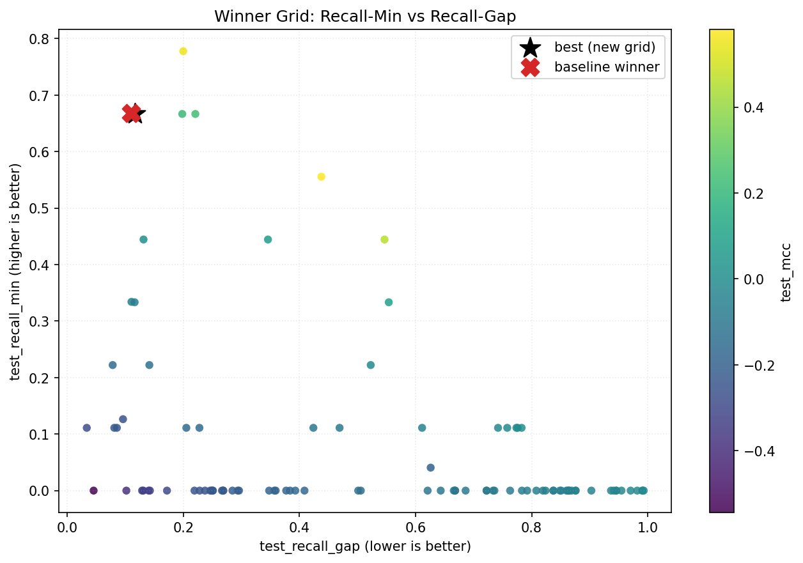
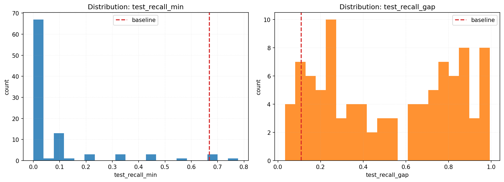
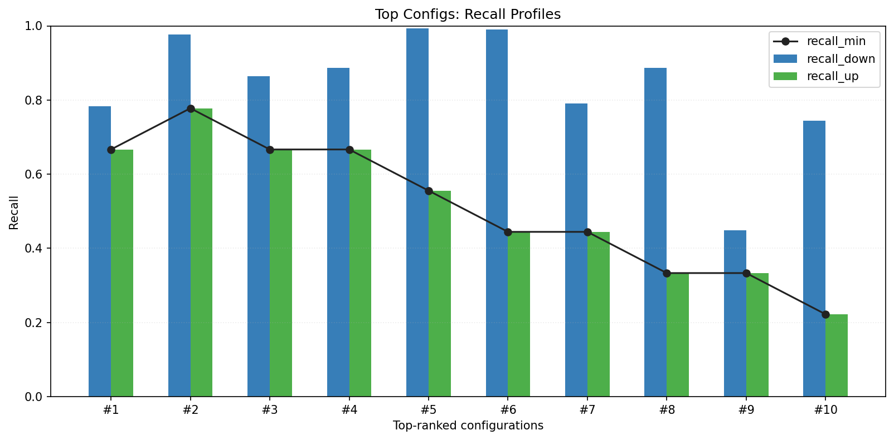
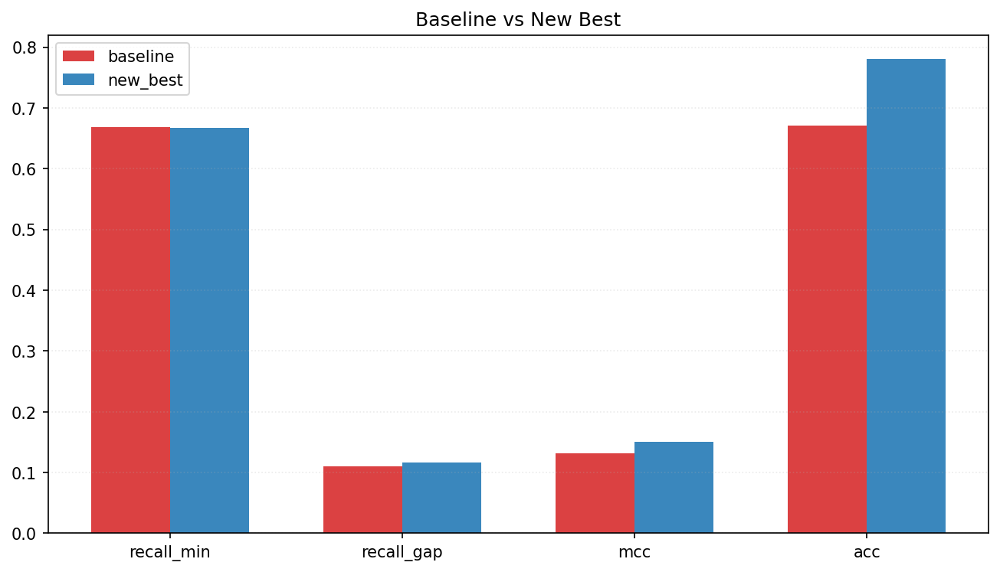
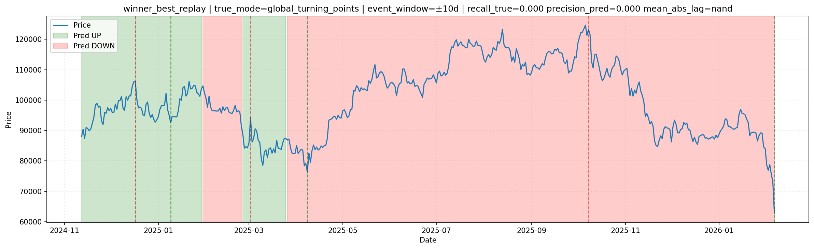

# Notebook-Style Post-Run Report (Winner DCN Grid Search)

- Source CSV: `RESEARCH/reports/astro_tabular_nn_grid_directional_segment_weighted_e8_t48_s2_20260208_070704.csv`
- Top15 CSV: `RESEARCH/reports/astro_tabular_nn_grid_directional_segment_weighted_e8_t48_s2_20260208_070704.top15.csv`
- Meta JSON: `RESEARCH/reports/astro_tabular_nn_grid_directional_segment_weighted_e8_t48_s2_20260208_070704.meta.json`
- Replay dataset path: `/home/rut/ostrofun/RESEARCH/cache/astro_tabular_nn_best_grid__dataset__0faeef66.parquet`
- Baseline selected CSV: `RESEARCH/reports/astro_tabular_nn_postrun_wide_balance_20260208_055915/selected_models.csv`
- Generated at: `2026-02-08T12:12:27+00:00`
- Ranking objective: maximize `test_cutoff_score` (segment/recal objective with class-gap penalties), then maximize `test_recall_min`, then minimize `test_recall_gap`, then maximize `test_mcc`, then `test_acc`.

## Baseline vs New Best

- Baseline model: `dcn_dropout_high` (`dcn`), seed `45`
- Baseline test: recall_min=`0.6682`, recall_gap=`0.1096`, MCC=`0.1314`, ACC=`0.6704`

- New best run_id `26`, seed `44`, dims `256x128`
- New best test: recall_min=`0.6667`, recall_gap=`0.1166`, MCC=`0.1504`, ACC=`0.7810`

- Delta recall_min: `-0.0015`
- Delta recall_gap: `+0.0070` (negative is better)
- Delta MCC: `+0.0189`
- Delta ACC: `+0.1106`
- Delta cutoff_score: `n/a` (baseline table has no cutoff_score)

## Grid Coverage Summary

- Total runs: `96`
- Runs with `test_recall_min >= 0.5`: `5`
- Runs with `test_recall_min >= 0.6`: `4`
- Runs with `test_recall_min >= baseline (0.6682)`: `1`

## Charts

### 1) Recall-Min vs Recall-Gap (all runs)



### 2) Metric Distributions



### 3) Top Recall Profiles



### 4) Baseline vs New Best



### 5) Test Price Markup (Best Run Replay)

- Event recall (true): `0.0000`
- Event precision (pred): `0.0000`
- Mean abs lag (days): `n/a`
- Events: true=`6`, pred=`3`, matched=`0`



## Conclusions & Next Grid

- Top-15 trend corr(`hidden_sum`, `recall_min`) = `-0.320`.
- Top-15 trend corr(`dropout`, `recall_min`) = `+0.317`.
- Runs with `recall_min >= 0.60` in current table: hidden_dims `256x128, 384x192x96`, dropout `0.50, 0.55, 0.60`.
- Practical takeaway: trend is now measured under segment-weighted TP reward; compare both `test_cutoff_score` and `test_recall_gap` jointly.
- Next directional grid to test your hypothesis safely:
  - hidden_dims: `192x96`, `256x128`, `320x160`, `384x192x96`
  - dropout: `0.40, 0.45, 0.50, 0.55, 0.60`
  - keep DCN and test both `cross 2..6` with `rank 32..96`
  - preserve objective: maximize `test_cutoff_score` (segment-weighted), keep `test_recall_gap` under control

## Leaderboard (Top 15)

- Saved table: `RESEARCH/reports/astro_tabular_nn_winner_grid_report_segment_weighted_20260208_070704/astro_tabular_nn_grid_directional_segment_weighted_e8_t48_s2_20260208_070704.top15.csv`

```text
 run_id  seed model_type hidden_dims  dropout  cross_layers  cross_rank  learning_rate  weight_decay  class_weight_power  label_smoothing  batch_size cutoff_objective  best_margin  best_val_score  test_cutoff_score  test_segment_weighted_hit_rate  test_segment_weighted_majority_hit  test_recall_down  test_recall_up  test_recall_min  test_recall_gap  test_mcc  test_acc
     26    44        dcn     256x128     0.60             6          96         0.0003       0.00001                 1.6             0.02         768 segment_weighted         0.90        0.398846           0.846537                        0.952867                            1.000000          0.783296        0.666667         0.666667         0.116629  0.150371  0.780973
     48    45        dcn     256x128     0.50             5          48         0.0005       0.00010                 1.5             0.02         768 segment_weighted         0.77        0.427736           0.846065                        0.987944                            1.000000          0.977427        0.777778         0.777778         0.199649  0.554522  0.973451
     11    44        dcn  384x192x96     0.55             6          96         0.0003       0.00001                 1.5             0.08         384 segment_weighted         0.73        0.539449           0.812120                        0.965777                            1.000000          0.864560        0.666667         0.666667         0.197893  0.210154  0.860619
      8    44        dcn  384x192x96     0.60             2          48         0.0005       0.00030                 1.4             0.02         384 segment_weighted         0.83        0.339436           0.802559                        0.969364                            1.000000          0.887133        0.666667         0.666667         0.220467  0.234820  0.882743
     28    45        dcn     256x128     0.50             5          48         0.0005       0.00010                 1.3             0.05         384 segment_weighted         0.67        0.401007           0.675347                        0.981984                            1.000000          0.993228        0.555556         0.555556         0.437672  0.581417  0.984513
     15    45        dcn     256x128     0.55             5          48         0.0005       0.00005                 1.6             0.05         512 segment_weighted         0.88        0.419898           0.594556                        0.977390                            0.961884          0.990971        0.444444         0.444444         0.546526  0.461307  0.980088
     36    44        dcn      192x96     0.60             2          48         0.0003       0.00030                 1.6             0.02         384 segment_weighted         0.76        0.378778           0.585001                        0.850301                            0.961884          0.790068        0.444444         0.444444         0.345623  0.079797  0.783186
     35    45        dcn      192x96     0.55             6          32         0.0003       0.00010                 1.4             0.05         768 segment_weighted         0.65        0.335338           0.557317                        0.956658                            0.961884          0.887133        0.333333         0.333333         0.553800  0.095729  0.876106
     39    44        dcn     320x160     0.40             5          48         0.0008       0.00010                 1.4             0.05         512 segment_weighted         0.57        0.429210           0.540546                        0.684845                            0.851429          0.449210        0.333333         0.333333         0.115877 -0.061020  0.446903
     18    45        dcn     256x128     0.50             4          48         0.0008       0.00030                 1.4             0.08         512 segment_weighted         0.62        0.379325           0.535799                        0.929830                            0.961884          0.744921        0.222222         0.222222         0.522699 -0.010539  0.734513
     20    44        dcn  384x192x96     0.60             4          96         0.0010       0.00010                 1.4             0.08         768 segment_weighted         0.50        0.483283           0.475556                        0.882629                            0.851429          0.501129        0.000000         0.000000         0.501129 -0.139415  0.491150
     29    44        dcn  384x192x96     0.40             4          96         0.0005       0.00001                 1.3             0.02         512 segment_weighted         0.72        0.491309           0.463612                        0.922009                            0.961884          0.722348        0.111111         0.111111         0.611237 -0.052143  0.710177
     30    45        dcn     256x128     0.55             4          64         0.0010       0.00030                 1.4             0.05         512 segment_weighted         0.59        0.334168           0.431945                        0.572353                            0.961884          0.575621        0.444444         0.444444         0.131176  0.005671  0.573009
     24    44        dcn  384x192x96     0.50             3          32         0.0003       0.00010                 1.6             0.02         512 segment_weighted         0.53        0.406490           0.405766                        0.908808                            0.961884          0.665914        0.000000         0.000000         0.665914 -0.099452  0.652655
     34    45        dcn     320x160     0.50             5          48         0.0003       0.00001                 1.5             0.02         768 segment_weighted         0.81        0.416313           0.401470                        0.945319                            0.961884          0.869074        0.111111         0.111111         0.757963 -0.008216  0.853982
```